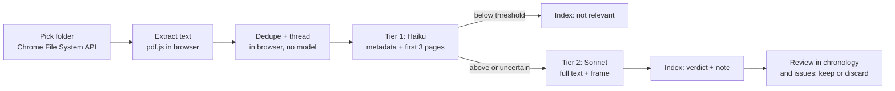

# ELJ Document Sift — Specification

As at 19 September 2026. Author: Tom Lowe. Source of truth: the live spec doc on claude.ai; this file is the repo copy.

## Purpose

Document Sift reads a large external document set (several thousand PDFs on a USB) without uploading or storing it, and produces a relevance-and-novelty index for one matter. Relevance is judged against one or two anchor documents and the matter's existing chronology or a designated chronology. The index surfaces material that is new or adds detail, so only that material is uploaded into ELJ.

The tool does not store document text from the USB. It stores only per-document results: metadata, scores, verdicts and a short note. It is a triage instrument, not a substitute for reading the shortlist.

In scope for the first build: deduplication of near-identical documents, email-thread reconstruction so that a chain appears once rather than as every forwarded copy, and a review mode in which each new document is decided on (keep or discard) while reading the chronology or an issue. Out of scope: privilege review, which can be added as a later rule.

## Where it lives

Document Sift is its own top-level tab, scoped to the open matter, with everything sift-related inside it. Existing tools, the matter's documents, its chronology and its issues are read by the Sift but never written to except through an explicit Accept.

**Panels within the tab:**

| Panel | Purpose |
| --- | --- |
| Frame | Choose anchor documents and chronology; add rules; build and approve the brief |
| Sift | Pick folder; run OCR check, dedupe, threading, Tier 1 and Tier 2; progress |
| Index | The master table of every file, with filters, decisions and export |
| Chronology view | The matter's chronology with sifted documents shown inline at their dates, marked new |
| Issues view | Per-issue lists of sifted documents grouped by effect |
| Bundle refs | Matches between sifted documents and existing matter documents, for confirming bundle references |
| Accept | The queue of decided documents and the controls to move them into the matter |

**Isolation.** The Chronology and Issues views are read-only copies rendered from the matter's data plus the sift overlay. Until Accept is used, nothing in `documents`, the chronology or the issues changes, and the ordinary tools see no difference. This means the whole sift can be run, reviewed and abandoned without effect. It also means the existing Chronology tool's UI is not modified; the sift view is a new rendering in `sift.js`.

**Navigation.** Document Sift is a new top-level tab alongside Drafts and Library, appearing when a matter is open, with a badge showing the count of documents awaiting decision. It is rendered entirely by `sift.js` with its own stylesheet scope (a `#sift-root` container and prefixed classes), so its layout and look can be changed freely without touching the rest of ELJ. `core.js` gains only the tab registration; no shared CSS is edited.

## Pre-processing: OCR on your machine

Every PDF on the USB gets a text layer before ELJ touches it. This runs once, unattended, on your Mac, and costs nothing beyond electricity.

**Tool:** `ocrmypdf`, an open-source command-line tool built on Tesseract. It leaves native PDFs alone (`--skip-text`), OCRs scanned pages, and writes a new PDF with an invisible text layer over the page image. The original files are never modified.

**Set-up (once, in Terminal):**

1. Install Homebrew if not already present (instructions at brew.sh).
2. `brew install ocrmypdf`
3. Copy the USB contents to a working folder on the Mac, e.g. `~/Discovery/raw`. Do not run against the USB directly; it is slow and risks corrupting the set if the drive disconnects.

**Run:** I will supply a short Python script, `ocr_batch.py`, delivered as a zip in the usual way and run with ` python3  ` + a space before the path. It walks `~/Discovery/raw` recursively, writes each processed file to `~/Discovery/ocr` under the same relative path, skips files already done (so it can be stopped and restarted), and writes `ocr_log.csv` recording each file's outcome: native, OCR'd, failed, or password-protected.

**Expectations:** native PDFs pass through in under a second each. Scanned pages take 2–5 seconds a page on a recent Mac. A mixed set of several thousand files is an overnight run, possibly two. Files that fail (encrypted, corrupt, image-only formats ocrmypdf cannot read) are listed in the log for manual attention and are not lost.

**Why local rather than in ELJ:** OCR in the browser (tesseract.js) is roughly ten times slower and ties up the tab for days. OCR on Vercel would require sending every page image to the server, which is the transfer and storage cost the whole design is trying to avoid.

## The relevance frame

The frame is a condensed brief built once per matter and reused for every document, so the reference material is read by the model only once.

**Inputs:** one or two anchor documents (typically the pleading or a key witness statement), the matter's existing or a designated chronology, and optional user rules in plain English.

**Build:** a single Sonnet pass over the inputs produces a structured brief:

- **Issues** — the live legal and factual issues, numbered.
- **Parties and actors** — names, roles, aliases and email domains to watch for.
- **Timeline** — the chronology's entries, each with an ID, date, one-line description and the documents it already relies on.
- **Known documents** — titles, dates and identifiers of documents the chronology already cites, so duplicates are recognised.
- **Rules** — your plain-English instructions as given, e.g. "treat anything from the Q3 2019 board pack as high relevance" or "ignore routine payroll correspondence".

The brief is stored in a new `sift_frames` table and shown to you for approval before any sift runs. You can edit it directly. It is deliberately compact (target under 8,000 tokens) so it fits alongside each document in a single model call.

**Re-use and refresh:** when the chronology is updated after a first sift, the frame is rebuilt and a second sift over the same folder compares only against the new frame. Documents already verdicted are skipped unless you choose to re-run them.

## Sift pipeline

The browser reads the files; the server judges them; only the judgement is kept.

Each document is scored twice at most: cheaply on its opening pages, then fully only if it earns it.

**Step 1 — folder selection.** A new Sift panel in the Tools tab. You choose `~/Discovery/ocr` via Chrome's directory picker. The browser lists every PDF with its relative path and size; nothing is sent yet. The list is saved to `sift_documents` (path, size, hash) so progress survives a closed tab.

**Step 2 — text extraction.** pdf.js, already used for the Legislation Library, extracts text in the browser. Documents over a size cap (proposed 400,000 characters) are truncated for Tier 1 and split into labelled parts for Tier 2, following the existing full-document-reading convention.

**Step 3 — Tier 1 (Haiku).** Filename, path, page count and the first three pages go to `/api/sift-triage` with the frame. Haiku returns document type, apparent date, parties, a relevance score 0–100, and a confidence flag. Documents scoring below the threshold (default 25) stop here.

**Step 4 — Tier 2 (Sonnet).** The full text and frame go to `/api/sift-assess`. Sonnet returns the per-document result below.

**Per-document result schema** (stored in `sift_documents`):

| Field | Type | Notes |
| --- | --- | --- |
| `relative_path` | text | Path within the chosen folder |
| `sha256` | text | For dedupe and re-run detection |
| `doc_type` | text | Letter, email, board minute, invoice, etc. |
| `doc_date` | date | Best inferred date, null if none |
| `parties` | text\[\] | Names matched against the frame |
| `relevance` | int 0–100 | Tier 2 score if run, else Tier 1 |
| `novelty` | enum | `covered` / `adds_detail` / `new_event` / `uncertain` / `not_relevant` |
| `chronology_refs` | text\[\] | Frame timeline IDs the document touches |
| `issue_refs` | int\[\] | Frame issue numbers |
| `note` | text | One or two sentences: what it shows and why it matters |
| `confidence` | enum | `high` / `medium` / `low` |
| `tier` | int | 1 or 2 |

**Batching.** The browser sends documents in batches of 10 to keep each serverless call well under `maxDuration`. Client-side concurrency of 3 batches. Progress bar shows done / total and running cost estimate.

**Model choice.** Haiku for Tier 1 on cost. Sonnet 4.6 for Tier 2 to match the rest of ELJ. Opus is not needed for triage; the shortlist will be read properly downstream.

## Deduplication and email threads

Copies and chains are collapsed in the browser before any model call, so the model reads each piece of content once and the index shows one row per thing.

**Exact duplicates.** `sha256` of the file bytes. A second file with the same hash is recorded as `duplicate_of` the first and never sent for scoring. Its path is kept, so you can see where copies sat in the production.

**Near-duplicates.** After text extraction, each document's text is normalised (whitespace, case, punctuation, page headers and footers stripped) and fingerprinted with MinHash over word shingles. Two documents with similarity above 0.9 are treated as one: the longer becomes the representative, the other is `duplicate_of` it. This catches the same letter saved as PDF and as a scan, the same board pack with a different cover sheet, and the same contract with and without a signature page. It runs entirely in the browser and costs nothing. The threshold is tunable; 0.9 is conservative and will not merge different drafts of the same document, which you usually want kept apart.

**Email threads.** Emails are the main source of bulk in a production because every reply carries the chain below it. Threading is done in three steps:

1. **Parse.** For each document that looks like an email (header block with From / To / Sent / Subject at the top), extract those fields and split the body at quoted-reply boundaries ("From: … Sent: …" blocks, "On … wrote:" lines, "-----Original Message-----").
2. **Group.** Normalise the subject (strip Re, Fw, Fwd, RE, and bracketed tags) and group by normalised subject plus overlapping participants. Within a group, order messages by Sent time. Each distinct message (by sender, time and first 200 characters of its own text) gets one `message_id`; a later email in the chain that quotes it does not create a new message.
3. **Represent.** The latest email containing the full chain is the representative document for the thread. Every other file in the group is marked `thread_id` and `thread_position`, with `superseded_by` pointing at the representative. Attachments are treated as their own documents but linked to the thread.

Only the representative goes to Tier 1 and Tier 2. The index shows the thread as one expandable row: subject, participants, date range, message count, and the verdict. Expanding shows each distinct message with its own date and sender, so you can still cite a particular email in the chain.

**Where the model helps.** Threading by header parsing handles the large majority. Ambiguous cases (subject changed mid-chain, forwards with a new subject, emails converted to PDF in odd layouts) are passed to Haiku with the candidate group and asked which messages are the same conversation. This is a small fraction of the set.

**Honest limits.** Two separate conversations with the same subject line between the same people on the same day can be merged wrongly; expanding the row shows this and a Split action fixes it. Near-duplicate detection will not catch a document that has been substantively edited, which is correct: an edited version is a different document.

**Schema additions** (to `sift_documents`): `duplicate_of`, `similarity`, `thread_id`, `thread_position`, `superseded_by`, `is_representative`, `message_count`.

## The uncertain bucket

Uncertainty is shrunk in four ways before it reaches you, and what remains is made cheap to clear.

**1. Define it narrowly.** A document is `uncertain` only when Tier 2 cannot decide between `covered` and `adds_detail`, or between `adds_detail` and `new_event`. Low relevance is not uncertainty; it is `not_relevant`. In practice this confines the bucket to documents that plainly matter but whose overlap with the chronology is unclear, which is exactly the set worth a second look.

**2. Ask a second, narrower question.** Uncertain documents get an automatic third pass: Sonnet is shown only the two or three chronology entries the document was matched to, side by side with the document's key passages, and asked one question: does this document add a fact, date, party or quotation those entries do not already contain? Most uncertain verdicts resolve at this step because the comparison is concrete.

**3. Cluster the rest.** Remaining uncertain documents are grouped by the chronology entries they touch. You review a cluster, not a list: "seven documents relating to the March 2020 board meeting" with the entry shown alongside. A single decision per cluster (covered / adds detail / new) is applied to all members, with the option to split out exceptions.

**4. Learn from your decisions.** Each manual verdict is stored with the document's features. Before the next sift on the same matter, those verdicts are summarised into the frame's Rules section ("Tom treats internal cover emails forwarding an already-known attachment as covered"). The bucket shrinks on each run.

**What you will actually see:** a filter on the index showing uncertain documents grouped by cluster, each with the matched chronology entry, the document note, and three buttons. On a set of several thousand files a realistic expectation is a few dozen clusters after step 2, an hour or two of review rather than a day.

**Honest limit:** a document relevant to an event the chronology omits entirely will be flagged `new_event`, not uncertain. That is correct behaviour, but it means the `new_event` list also needs your eye; it is where chronology gaps surface.

## Output: the index

The index is a sortable table in the Sift panel, backed by `sift_documents`, with export and a one-click path into the matter.

**Views.** Default sort is novelty then relevance: `new_event` first, then `adds_detail`, then `uncertain`, with `covered` and `not_relevant` collapsed. Filters by document type, date range, party, issue number and chronology entry. A free-text search over notes.

**Columns shown:** path, date, type, parties, relevance, novelty, matched chronology entries, note, confidence. Clicking a row opens the local file in a new tab via the File System API handle, so you read the original without uploading it.

**Export.** Excel via the existing export path, all columns plus a sheet of frame issues and timeline for reference. This is the document you can hand to a paralegal or opposing side's list-comparison.

**Upload shortlisted documents.** Tick rows and choose Upload to Matter. The browser reads each ticked file from the folder handle and uploads it through the existing document pipeline. The `sift_documents` row is stamped with the resulting `documents.id`. Nothing unticked ever leaves your machine.

**Into the chronology and issues.** `new_event` and `adds_detail` rows are not pushed from the index; they are decided in the chronology and issue views (below), where each proposed line and issue effect is shown in place and you tick or cross it, approval being the default. The index remains the master list and shows each document's decision.

## Downstream use in ELJ

Yes: once shortlisted documents are uploaded, every existing tool sees them as ordinary matter documents, and the sift results add a layer the tools can use.

**Most existing tools, unchanged.** Issues, Draft and the others read from the matter's documents table. Uploaded shortlist documents enter that table through the normal pipeline and are picked up on the next run. No tool changes are needed for those.

**The Chronology tool is the exception** (19 September 2026). It changes from producing text to maintaining entries, so that the sift can amend the chronology and hand it back. See "The chronology: one table, two windows" below, and Push 6a.

**Existing tools, enriched (optional, later push).** Each uploaded document carries its sift metadata: date, type, parties, issue references, chronology references and note. Two uses follow:

- **Chronology consolidation** can use `chronology_refs` to place new documents against existing entries directly, rather than rediscovering the overlap.
- **Issues and Draft** can filter documents by `issue_refs`, so a skeleton on one issue reads only the documents the sift tied to it. This is a meaningful cost and quality gain on a large matter.

**Analysis over the whole set without uploading.** The index itself is analysable. Because `sift_documents` holds structured results for all several thousand files, a new tool, Sift Analysis, can run over the index alone: "what does the discovery show about issue 3 that the chronology does not?", "list every document from party X in Q2 2020 and what each shows", "which chronology entries have the thinnest documentary support?". It answers from notes and metadata, not full text, so it is cheap and fast. Where it needs the full text of a document, it tells you to upload that one.

**What it cannot do.** Draft and Issues will not cite a document that has not been uploaded, and should not, because a citation must be to text the model has read in full. The sift is the sieve; the tools work on what passes through it.

**Why the tab exists.** Not to let the tools reach documents that were never uploaded, but to avoid uploading tens of thousands of them. The sift decides which few hundred earn a place in the matter; those are uploaded, and are then ordinary documents to every tool. The saving is in what never gets uploaded, not in a shortcut past uploading.

## The chronology: one table, two windows

Decided 19 September 2026. This replaces the original "Review mode" design,
which assumed the chronology was already a set of addressable entries. It is
not: today the chronology is text produced by the Chronology tool and stored in
`tool_jobs`. Everything below follows from making it entries.

The chronology is **one set of entries**. The Chronology tool and the Document
Sift are two windows onto it, not two chronologies to be reconciled. Drafts and
the other tools read it wherever they read the chronology today.

**The round trip:**

1. The **Chronology tool** produces the first chronology from the matter's own
   documents, as it does today.
2. **Document Sift opens on that chronology** and amends it from the discovery
   set: new entries where a document shows an event the chronology lacks, added
   detail where it shows more about an event already there.
3. The sift also writes **pinpoints onto entries that already exist** — entries
   whose documents the matter already held, but with no page or bundle
   reference. The production carries references the matter's own copy never
   had; this is that insight applied to the chronology rather than to a
   document.
4. **You review and finalise in the sift.**
5. The finalised chronology **is** the chronology. It appears in the Tools
   section, where you amend it by hand, and that is what Drafts and the other
   tools use.
6. **You can return to the sift and revise.** There is no one-way gate.

**Propose against, never regenerate** (decided 19 September 2026). Once entries
exist, pressing Chronology in Tools does not lay fresh text over the top of
them. It reads the existing entries, proposes additions and changes for the
documents it has not yet accounted for, and you approve them — the same review
pattern the sift uses, so the two behave alike. This is the rule that makes the
round trip safe: nothing the model generates can silently discard an entry you
finalised.

It is also a real change to what that button does. The Chronology tool stops
producing a document and starts maintaining a list. That work is Push 6a.

### Reviewing in the sift

**Default is approval.** An entry is in unless you cross it out. You scroll and
tick or cross, deciding many at once rather than one at a time, and an
untouched entry is approved.

That default is only safe because an excluded entry is **recorded, not
destroyed**: it stays in the table marked excluded for insufficient relevance,
and can be reinstated. Contrast the Precedent Library tidy, which defaults to
Rename precisely because deleting there cannot be undone. Here the cheap
default is the reversible one, so it can also be the fast one.

**What each row shows:** the proposed line in the existing chronology format,
its date, the document it rests on with its pinpoint, and — for an amendment —
the entry it would change, with the addition marked. New entries are visibly
marked as new and stay marked until you clear the flag, so what a production
added remains distinguishable from the chronology as it stood.

**Issue review** works the same way, grouped by `issue_effect` (`adds` /
`changes` / `neutral`, with `changes` first) and sharing one decision per
document: a document decided in one view is decided in the other.

### What this needs

A `chronology_entries` table: `id`, `matter_id`, `owner_id`, `entry_date`,
`description`, `source_document_id`, `pinpoint`, `status`
(`active` / `excluded`), `exclusion_reason`, `flag_new`,
`source_sift_document_id`, `created_at`. It is **not** in Push 1, which is
already merged; it belongs with Push 6a.

Seeding it means parsing the tool's existing prose into dated rows, which is
lossy — some entries will not split cleanly. The frame build shows you what it
extracted before anything relies on it, which fits, since you approve the frame
anyway.

**Schema additions** (to `sift_documents`): `issue_effect`, `decision`
(`keep` / `discard` / `defer` / null), `decided_at`, `chronology_line`
(proposed text), `chronology_entry_id` once written.

## Accepting documents into the matter

Accept is the single gate between the sift and the ordinary tools. It works on one document, a selection, or a whole filtered set, and does the same three things each time.

**What Accept does per document:**

1. Uploads the file from the local folder through the existing document pipeline, so it becomes an ordinary row in `documents` with full text extracted as for any upload. Bundle reference, sift date, type and parties are written onto that row.
2. Writes the chronology line, if one was kept, as an amendment or new entry, flagged new and linked to the document.
3. Records the issue references on the document so Issues and Draft can filter by them.

After Accept, every existing tool sees the document exactly as if you had uploaded it by hand. The sift row is stamped `accepted_at` and `document_id`.

**Granularity:**

- **Individually** — the Keep button in either review view accepts that document at once (or queues it, see below).
- **In batches** — the Accept panel lists everything decided Keep but not yet accepted. Select all, select by filter (issue 3 only; `new_event` only; one thread), or tick rows, then Accept selected. Batches run through the same upload pipeline with a progress bar and a per-document success or failure line.
- **Queue or immediate** — a setting on the panel. Immediate suits a small careful review; queue suits a long session where you decide first and upload once at the end.

**Threads.** Accepting a thread uploads the representative email by default. Expand the thread to accept particular messages instead; each accepted message becomes its own document with the thread noted in its metadata.

**Undo.** Accepted documents can be withdrawn from the Accept panel for 24 hours: the document row, chronology line and issue references are removed and the sift row reverts to Keep. After that, removal is through the ordinary document delete.

**Cost.** Accept is where storage cost is incurred, and only there. The panel shows the count and total size of the pending queue before you commit.

**Documents the matter already holds, repaginated** (open, 19 September 2026).
It was decided that a `covered` document is never uploaded and only its bundle
reference is written onto the existing record. That holds where the two copies
paginate alike. It does not where the production has repaginated a document the
chronology already cites: a single `bundle_ref` range names the document but
cannot pinpoint a page inside it, and the matter's stored chunks still carry the
old pagination, so the model would cite pages that do not exist in the edition
being read. Three ways out, in rising cost:

- **A page map** on the existing document — matter page N to bundle page M.
  Cheapest, and right wherever the two differ only by an offset, which is
  common for a stamped copy. Wrong wherever pages were inserted or dropped.
- **Re-chunk from the production text** without storing the file. The text is
  read in the browser anyway, so the existing document's chunks can be rebuilt
  carrying bundle page numbers. No new storage, but the matter's copy is then
  described by text it does not itself hold.
- **Upload the production copy** and mark the matter's existing copy
  superseded, keeping both rows so old citations still resolve. Exact, and the
  only option that survives the two copies being substantively different, but
  it is the storage cost the design exists to avoid.

Recommended: the third, confined to the documents the chronology actually
relies on — a small set, and the ones where a wrong pinpoint does real damage —
with a page map for the rest. Not yet decided.

**Schema additions** (to `sift_documents`): `accepted_at`, `document_id`, `accept_batch_id`.

## Trial bundle references

Many sifted documents will already be in the matter, but the production carries the trial bundle reference and the matter copy does not. The Sift captures the reference from every file and writes it onto the matching existing document, so the ordinary tools cite by bundle reference from then on.

**Capturing the reference.** Three sources, tried in order:

1. **Folder and filename** — bundles are usually produced as `Bundle C/Tab 12/C-12-0345.pdf` or similar. A configurable pattern in the Frame panel (with sensible defaults for `[X/nn/pppp]` and `X-nn-pppp` forms) extracts volume, tab and page.
2. **Page stamp** — the reference stamped in the header or footer of each page. The extractor reads the first and last lines of the first three pages and matches the same pattern. Where a document spans pages, the start and end pages are both captured.
3. **Index document** — if the production includes a bundle index (a spreadsheet or PDF listing every document with its reference), you upload it in the Frame panel and it is used as the authoritative map from filename to reference.

The captured reference is stored on the sift row as `bundle_ref` (e.g. `C/12/345–352`), with `bundle_ref_source` recording which method produced it. Files with no reference found are flagged in the Index for manual entry.

**Tianrui: a hyperlinked index is supplied.** The production will arrive with an index whose entries link to the files. This becomes the primary source and changes the pipeline in three ways:

- **Reference map.** The index is parsed in the browser (PDF link annotations, or Excel/Word hyperlink cells, depending on format) to produce `bundle_ref` → relative file path for every entry. Pattern matching on filenames and page stamps is used only for files the index does not cover, and those are flagged.
- **Metadata for free.** Index entries usually carry date, description and sometimes author and recipient. These are stored on the sift row before any model call and shown to Haiku alongside the first pages, which improves Tier 1 scores and lowers cost on short or badly scanned documents.
- **Completeness check.** Files in the folder not in the index, and index entries with no file, are listed at the top of the Index panel. Both are common in productions and worth knowing before the sift runs.

The index file is uploaded once in the Frame panel. Its format is unknown until it arrives, so the parser is written when the file is in hand rather than speculatively; this sits in Push 3.

**Matching to existing documents.** For every sifted document, the frame's Known Documents list and the matter's `documents` table are searched for a match:

- exact text hash or near-duplicate similarity above 0.9 against the existing document's stored text — the strong signal;
- date, type and parties agreeing, with title similarity — the weak signal, used to propose a match for confirmation.

Strong matches are listed in the Bundle refs panel as confirmed; weak matches as proposed, with both documents' first page shown side by side. You confirm or reject proposed matches individually or Confirm all strong.

**Writing the reference.** On confirmation, `bundle_ref` is written onto the existing `documents` row. The sifted file is not uploaded; the matter already has the document. The sift row is marked `covered` with `matched_document_id`. Where an existing document already has a `bundle_ref` and the new one differs (re-paginated bundle), both are kept: `bundle_ref` is replaced and the previous value moves to `bundle_ref_prior`, so old citations can be traced.

**Use by the tools.** `documents.bundle_ref` is a new column. Once populated, the reference is passed to the model with each document so that inline citations follow the existing bundle-reference convention using the real reference rather than `[REF NEEDED]`. This is the one change to existing tools in the whole design and is a small addition to how documents are labelled when passed to the model, applied through a feature flag.

**Chronology and issues.** Existing chronology entries that rely on a matched document display its bundle reference once written. No entry text is changed; the reference is rendered from the document record.

**Schema additions:** `documents.bundle_ref`, `documents.bundle_ref_prior`; `sift_documents.bundle_ref`, `bundle_ref_source`, `matched_document_id`, `match_strength`, `match_confirmed`.

## Database, endpoints and files

Two new tables, three new endpoints, one new frontend file. `worker.js` and `cron-resume.js` are not touched.

**Tables** (migration with RLS and explicit `GRANT` to `anon`, `authenticated`, `service_role`):

| Table | Key columns | Notes |
| --- | --- | --- |
| `sift_frames` | `id`, `matter_id`, `owner_id`, `brief` (jsonb), `rules` (text), `version`, `created_at` | One row per frame build; latest version used |
| `sift_documents` | `id`, `matter_id`, `frame_id`, `owner_id`, result fields from the schema above, `manual_verdict`, `uploaded_document_id`, `created_at` | Unique on (`matter_id`, `sha256`) |

Ownership column is `owner_id`, matching `matters` and `drafts`.

**Endpoints** (each with its own `maxDuration`):

| Endpoint | Model | Input | Output |
| --- | --- | --- | --- |
| `/api/sift-frame` | Sonnet | Anchor text, chronology text, rules | Brief JSON, stored to `sift_frames` |
| `/api/sift-triage` | Haiku | Batch of up to 10: metadata + first 3 pages, plus `frame_id` | Tier 1 results |
| `/api/sift-assess` | Sonnet | Batch of up to 10: full text (parts if long), plus `frame_id` | Tier 2 results, written to `sift_documents` |

The uncertain-bucket second question runs through `sift-assess` with a `mode: "compare"` flag rather than a fourth endpoint.

**Frontend.** A new `sift.js`, plain JS, no ES modules, loaded after `library.js` and before the file that calls `init()`. It owns the Sift panel, folder handle, pdf.js extraction, batching, progress and index table. `core.js` gains only the tab registration. `public/index.html` and root `index.html` updated identically.

**Job survival.** The browser drives the loop, not the worker, so a closed tab pauses the sift rather than orphaning a `tool_jobs` row. Progress is in `sift_documents`; reopening the panel and re-picking the folder resumes from the first unverdicted file. This avoids the cron-resume machinery and its known traps entirely. The trade-off is that the tab must stay open for the sift to advance; on a multi-hour run that is acceptable for a one-off exercise.

**File System Access API.** Chrome and Edge only; Safari and Firefox do not support directory handles. Handles cannot be persisted across sessions without a permission prompt, hence re-picking the folder on resume.

## Cost, time, risks

For a set of 4,000 mixed PDFs averaging 15 pages, expect roughly two hours of sift time after an overnight OCR run, at a model cost in the low hundreds of US dollars. All figures below are approximate and should be checked against current API pricing before the run.

**Cost drivers.** The frame (about 8,000 tokens) is sent with every document. Prompt caching cuts the repeated frame cost by about 90% and must be enabled on both endpoints; without it the frame alone dominates the bill. Ensure prompt caching. Tier 1 on Haiku over all 4,000 documents: roughly 40M input tokens, tens of dollars. Tier 2 on Sonnet over a 30% shortlist: roughly 20–25M input tokens, plus output, under $100. Higher OCR quality lowers cost, because garbled text inflates token counts and lowers scores.

**Time.** Tier 1 in batches of 10, three concurrent, about 20 seconds a batch: 400 batches in roughly 45 minutes. Tier 2 on 1,200 documents, about a minute a batch: roughly 40 minutes. The tab stays open throughout.

**Risks and mitigations:**

| Risk | Effect | Mitigation |
| --- | --- | --- |
| Chronology has gaps | Relevant documents flagged `new_event` en masse | Review `new_event` list early; rebuild frame and re-sift once chronology updated |
| Poor OCR on faint scans | Low scores, missed material | `ocr_log.csv` flags low-confidence pages; spot-check a sample before sifting |
| Threshold set wrong | Too much or too little reaches Tier 2 | Run Tier 1 on a 200-file sample first, inspect the score distribution, then set the cutoff |
| Frame too long | Every call costs more | Cap at 8,000 tokens; chronology condensed to one line per entry |
| Tab closed mid-run | Sift pauses | Resume from `sift_documents`; no data lost |
| Browser not Chrome | Folder picker unavailable | Documented requirement; Chrome or Edge only |
| Near-duplicate documents | Same document verdicted repeatedly | Browser-side exact and near-duplicate detection plus email threading before scoring; Split action for wrongly merged threads |
| Model mis-scores a key document | Missed material | Anchor documents themselves are run through the sift as a calibration check and must score above 90 |

**What this does not remove.** The shortlist still needs reading. A sift of several thousand files that produces 300 documents to upload has done its job; it has not done yours. To understand the significance of documents they need to be able to be incorporated in a chronology and highlighted as new

## Conventions applied from CLAUDE.md

Checked against `CLAUDE.md` on `main` as at 19 Sep 2026 (latest entry v5.74). These bind every push below.

- **Fresh Supabase client inside each handler.** All three `sift-*` endpoints build the client in the handler, never at module scope, since Push 1 migrates tables they will touch.
- **Frame in the system prompt, byte-identical.** The frame goes in `systemBase` under the `cache_control` breakpoint; anything per-document (text, filename, batch position) goes in the user message. No timestamp, job id or counter may enter the system prompt or the cache is silently lost. Check `cache_read_input_tokens` on the first sample run.
- **Model selection.** `runTool` must accept a per-call model. If it does not, Push 4 adds a `model` parameter with the current default unchanged; Tier 1 passes the Haiku model id, Tier 2 the ELJ default.
- **Explicit whitelists.** Any new field the client sends is named in both the destructure and the parameters object of the endpoint that receives it, and a test guards it, as `case_law_context.test.js` does.
- **Pure helpers as plain scripts with tests.** Dedupe (normalise, shingle, MinHash), email-thread parsing and grouping, and bundle-reference parsing live in `public/js/sift_helpers.js`, loaded before `core.js`, exported through `module.exports`, and covered by `api/__tests__/sift_helpers.test.js`. CI (`npm test`) is the gate.
- **Browser extraction.** `extractPdfText` in `core.js` is reused, including its per-page `items` count, which separates a scan from a glyph-mapped PDF; both are reported in the Sift panel's read diagnosis, not silently skipped.
- **Cache-busting.** Every push that changes a `public/js/*.js` file bumps that script tag's `?v=` in both `public/index.html` and root `index.html`.
- **Ownership column.** `owner_id` on `sift_frames` and `sift_documents`, following `matters` and `drafts`; permission checks are done in the handler (service key bypasses RLS).
- **Migrations.** SQL files in `migrations/` with `GRANT` to `anon`, `authenticated`, `service_role`. Adding `bundle_ref` and `bundle_ref_prior` to `documents` is a nullable column addition; the Push 10 code reads it gracefully when absent, as `page_number` is handled.
- **Bundle references in the prompt.** Follow the `[p.N]` pinpoint pattern: the document label carries `[bundle C/12/345]` and the prompt rule tells the model to cite what is marked and never invent a reference.
- **Delivery.** Under the 10 Sep 2026 standing instruction, each push is a PR into `main`, CI green, rebase-merged. Pushes that add a migration or need testing against live data say so in the PR and stop for Tom.
- **House style.** British English in comments and UI; comments say why and carry a version marker.

## Build sequence

Twelve pushes, each one logical change, each preceded by the review gate: complete replacement file checked against `CLAUDE.md` and open hardening notes, findings listed, your go-ahead, then the script. Standard protocol throughout: fetch fresh from GitHub, `node --check`, SHA-256 round-trip, rollback bundle.

| Push | Content | Depends on | Verify by |
| --- | --- | --- | --- |
| 0 | `ocr_batch.py` — local only, no ELJ change | Homebrew, ocrmypdf installed | Run on 20 files; check `ocr_log.csv` and text selection in output |
| 1 | Migration: `sift_frames`, `sift_documents` (all columns), `documents.bundle_ref` and `bundle_ref_prior`, chronology `flag_new` and `source_sift_document_id`, RLS, grants | — | Tables and columns visible in Supabase; existing tools unaffected (nullable columns) |
| 2 | Document Sift tab in nav; `sift.js` shell with panels; Frame panel and `/api/sift-frame`; both `index.html` files | 1 | Tab appears with matter open; build a frame on a closed matter |
| 3 | Sift panel: folder picker, extraction, bundle-ref capture, exact and near-duplicate detection, email threading; preliminary Index | 2 | 200-file sample; refs, duplicates and threads inspected; Split tested |
| 4 | `/api/sift-triage` + Tier 1 loop over representatives, progress | 3 | Score distribution reviewed; threshold set |
| 5 | `/api/sift-assess` + Tier 2 loop, `issue_effect`, full Index with filters, uncertain clusters | 4 | Full run on sample; verdicts spot-checked against 10 known documents |
| 6 | Bundle refs panel: matching to existing documents, confirm, write `bundle_ref` | 5 | Confirm 10 matches; `documents.bundle_ref` populated |
| 6a | Chronology as entries: the `chronology_entries` table, seeded from the Chronology tool's existing output; the tool switches from regenerating to proposing against those entries | 1 | Existing chronology appears as rows; a re-run proposes additions rather than replacing what is there |
| 7 | Chronology view in the sift: inline new entries, proposed lines, pinpoints written onto existing entries, multi-select by ticking and crossing with approval as the default | 5, 6a | Decide 10 entries by ticking and crossing; exclusions recorded as insufficient relevance and reinstatable |
| 8 | Issues view grouped by `issue_effect`, shared decision state | 7 | Decide from issue page; chronology view reflects it |
| 9 | Accept panel: individual and batch accept, queue, undo, `flag_new` written | 7 | Accept 5 documents; confirm they appear in matter, chronology and next Chronology run |
| 10 | Bundle reference passed to model when labelling documents (feature flag) | 6 | Draft output on a test matter cites real references |
| 11 | Export to Excel with decisions and references | 5 | Open export; columns present |

Later, separately: Sift Analysis tool; sift metadata passed to Draft; learned rules folded into the frame; privilege rules.

**Sequencing note.** The Tianrui files arrive later, so Push 0 waits for them; Pushes 1–2 and the shell of 3 can be built and tested on a closed matter meanwhile. OCR remains the long pole once the files are in hand. Pushes 1–5, 8, 9 and 11 carry no risk to existing tools: new tables, nullable columns and a self-contained tab. **Two pushes change existing tool behaviour, not one as this spec first said.** Push 10 is one, behind a feature flag. Push 6a is the other, and the larger: it converts the Chronology tool from producing text to maintaining entries. It is not optional — Push 7 has nothing to review until those entries exist. That also retires the claim that nothing here touches `worker.js`, since chronology generation lives there. `cron-resume.js` is still untouched, so the open Step 3 cron hardening remains independent of this work, neither blocked by it nor a blocker for it.

**Open questions before push 1:**

- [ ] First target matter: Tianrui (decided 19 Sep 2026). Its anchor documents and
      chronology are **not yet loaded into ELJ** (confirmed 19 Sep 2026). They must be
      before Push 2 can be tested against a real frame, since the frame is built from
      them. Push 1 does not need them, and the `sift.js` shell of Push 2 can be built
      meanwhile. Left unticked: the question is answered, the loading is not done.
- [x] Chrome available on the sift machine — confirmed 19 Sep 2026
- [x] `owner_id` confirmed against the live schema, 19 Sep 2026, and used in the
      Push 1 migration. `matters` and `drafts` both carry it. Note `documents`
      and `chunks` carry no ownership column at all and scope through
      `matter_id` — so `drafts`, not `documents`, is the precedent the sift
      tables follow.
- [x] Chronology, decided 19 Sep 2026: one `chronology_entries` table, with the
      Chronology tool and the Sift as two windows onto it. A re-run proposes
      against the existing entries and never regenerates over them. Sift review
      defaults to approve; an exclusion is recorded as insufficient relevance,
      never deleted. See "The chronology: one table, two windows".
- [ ] Tier 1 threshold: start at 25 and tune, or set from the sample run only?
- [x] Bundle references: a hyperlinked index will be supplied with the files (confirmed 19 Sep 2026); format to be established when it arrives
- [x] Decided 19 Sep 2026: `covered` documents are never uploaded; only the
      bundle reference is written onto the existing record. **Reopened in part**
      by the next item.
- [ ] Repaginated documents the matter already holds: page map, re-chunk from
      the production text, or upload the production copy? A bundle reference
      alone names a document but cannot pinpoint a page inside it, and the
      matter's chunks carry the old pagination. See "Accepting documents into
      the matter" for the three options and the recommendation.
